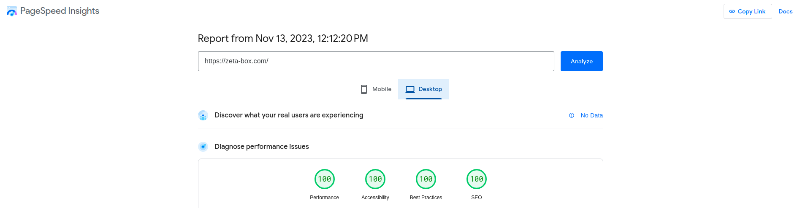
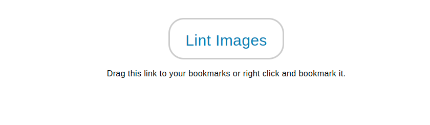

# Next js project guidelines
Date of creation: 13/11/2023

## Table of contents

[1. Introduction](#introduction)

[2. Lighthouse metrics](#lighthouseMetrics)
*  [2.1.Performance](#performance)
*  [2.2. Accessibility](#accessibility)
*  [2.3. Best Practices](#bestPractices)
*  [2.4. SEO](#seo)

[3. Useful links](#usefulLinks)


### Introduction <a name="introduction"></a>
This documentation provides general rules to follow when creating a Next js application.
The aim here is to create websites/web apps that satisfy modern norms.
We will be using the Zetabox Website as a reference.




We will not include detailed explanation about core Next js features (ex: /pages router or /app router) as these are choices that can be made by the developer.
That being said, it is recommended to use the latest stable version of Next js along with the features that it
provides.


### Lighthouse metrics <a name="lighthouseMetrics"></a>
The above image is an audit generated by [PageSpeed Insights](https://pagespeed.web.dev/).
Throughout the development phase of your Next js application, you can audit your page with Google Lighthouse.
Simply open up devtools (F12), navigate to Lighthouse and choose the device you want to analyze page load with.
4 types of scores will be displayed upon completion.
#### Performance <a name="performance"></a>
Think of the performance score as the main character of your Lighthouse report.
In your application, you can improve performance by simply taking advantage of Next js features.
These are the main points you should pay attention to:
**<ins>Data fetching</ins>** 
Whether by using the pages router APIs (getStaticProps, getServerSideProps,etc...), or by using the
App router server components feature, you should prioritize sending HTTP requests on the server-side.
This does not only improve performance, but also security, as your API would not be exposed on the client.
client rendered components should not make API calls unless it's absolutely necessary.
**<ins>Image optimization<ins>**
This is quite obvious but should be mentioned, always use the Next js [Image](https://nextjs.org/docs/pages/building-your-application/optimizing/images) component, this
is because it comes with features for automatic image optimization.
When working on your website's images, the best approach is to follow [the Next js docs](https://nextjs.org/docs/pages/building-your-application/optimizing/images). That being said,
here's a summary of what you should keep in mind:
* You will most likely be working with remote images, and in that case you'll have to provide height and width props to
infer the aspect ratio of the image, not the rendered size of the image file.
* For these remote images, you should define a list of supported URL patterns, for example:
```
const nextConfig = {
// other config parameters...
  images: {
    remotePatterns: [
      {
        protocol: 'https',
        hostname: 'example.s3.amazonaws.com',
        port: '',
        pathname: '/**',
      },
    ],
  },
};

```
in the above code snippet, we're telling Next js to only allow images from a specific AWS s3 bucket.
* For the image that will be the LCP (largest Contentful Paint) **of the page**, you should add the "priority" prop and avoid lazy loading,which is the default behaviour of the Image component.
```
<Image 
// other props...
 loading="eager"
 priority
 />
```
**Diving a little deeper in image optimization, we'll talk about formats and image sizes.**
- **Image sizes:** 
1- Add a "sizes" props to your Image component and assign a random value to it
2- You can [this linting tool](https://ausi.github.io/respimagelint/) to determine the correct values of the "sizes" prop
Follow this instruction

Once bookmarked, go to the page that contains the Image and click Lint Images. This will provide you with the values that you should use for the "sizes" prop.
Here is a quick demonstration on how to do this, skip ahead to 12:40 in the video:
<iframe width="1000" height="650" src="https://www.youtube.com/embed/gpJKj45AikY?start760=&end=962;" title="Next.js Image Optimization with Image Component | Responsive Images" frameborder="0" allow="accelerometer; autoplay; clipboard-write; encrypted-media; gyroscope; picture-in-picture; web-share" allowfullscreen></iframe>

- **Formats:** add this line to your images config.
```
// in next.config.js
const nextConfig = {
// other config parameters...
  images: {
   formats: ['image/avif', 'image/webp'],
  },
};
```
A more in depth explanation on both these topics is of course provided by [the Next js image configuration docs.](https://nextjs.org/docs/app/api-reference/components/image#configuration-options)

**<ins>Font optimization<ins>**
Once again, Next js provides us with automatic optimization using *"next/font"*.
When working with google fonts, Next js recommends [variable fonts](https://fonts.google.com/variablefonts) for which you don't have to specify a font weight.
In the Zetabox website, we used the Poppins font which is not included in  the list. If that is the case for you, here's an example of how we configured it:
```
// in the _app.js file
import {Poppins} from "next/font/google"

const poppins = Poppins({
  subsets: ['latin'],
  display: 'swap',
  variable: '--font-poppins',
  weight: ['100', '200', '300', '400', '500', '600', '700', '800', '900']
})

export default function MyApp({ Component, pageProps }) {
  return (
    <main className={poppins.className}>
      <Component {...pageProps} />
    </main>
  )
}
```
You can also do this for specific pages, in case you use different fonts for different pages

```
// in pages/index.js
import { Inter } from 'next/font/google'
 
const inter = Inter({ subsets: ['latin'] })
 
export default function Home() {
  return (
    <div className={inter.className}>
      <p>Hello World</p>
    </div>
  )
}
```
Check out [Font Optimization in the Next js docs](https://nextjs.org/docs/pages/building-your-application/optimizing/fonts) for further details.

#### Accessibility <a name="accessibility"></a>
For accessibility, you probably won't have to do much. For as long as you follow basic HTML rules, you'll have a good metric score.
These are rules like:
* Only use one **h1** tag for a single page
* Have correct headings order: **h1->h2->h3...**
* Respect the parent/child tags. ex: no **button** tag should be the parent of a **div** tag
* Lists (**ul**,**ol**...) should not be empty, they should contain **li** tags
* Don't overuse **div** and **span** elements.
* Play close attention to interactive elements (hyperlinks,buttons, form inputs...) and make sure they are labeled.
And many more. Not to worry however, just use the browser console and make sure you deal with the warnings it throws at you, **those are not to be ignored.**
#### Best Practices <a name="bestPractices"></a>
Same as accessibility, most of the work is done under the hood for you. As long as your app is mobile friendly, you don't ignore console errors, 
have no unused JavaScript and CSS and properly size images (which we already covered), you most likely won't have to do much else.
#### SEO <a name="seo"></a>
While performance is of utmost importance, SEO is very crucial for any website. In this segment we'll cover the basic steps that have to be followed for any web page.
It's noteworthy that these steps differ between the Next js **pages router** and the more modern **app router**, the basics however remain the same:
* Pages need to have meta data such as title and description.
* Proper use of heading tags,( h1, h2, etc.) contributes to a clear and hierarchical structure for content.
* Image alt text
* Structured Data
* Favicon
* Sitemap
* 404 page

**<ins>Meta Data</ins>**

**If you use  the pages router** (which is the case for the Zetabox website), the [NextSeo npm package](https://www.npmjs.com/package/next-seo) is excellent. From implementing standard title and description meta data to JSON-LD components, simply follow along the package documentation for your specific needs.
Here's an example from our codebase:

```
// in /pages/index.js
<NextSeo
        title={data?.data?.attributes.HomePageSEO.metaTitle}
        description={data?.data?.attributes.HomePageSEO.metaDescription}
        canonical={data?.data?.attributes.HomePageSEO.canonicalURL}
        openGraph={{
          type:"website",
          images: [
            {
              url: seoImage?.url,
              height: seoImage?.height,
              width: seoImage?.width,
              type: seoImage?.mime,
              alt: seoImage?.alternativeText,
            },
          ],
        }}
      />
```
structured data example:
```
// in /components/job/JobDetails
        <JobPostingJsonLd
          // add this if you're using the app router
             useAppDir={true}
          //
          datePosted={createdAt}
          description={seo.metaDescription}
          hiringOrganization={seo.structuredData.hiringOrganization}
          employmentType={employmentType}
          title={title}
          />
```

**<ins>Favicon</ins>**
It is advised to add a favicon to your site, this improves SEO because Google automatically tries to access the URL https&#58;//www.yoursite.com/favicon.ico when it crawls a page. So if you don 't have a favicon Google will see as many 404 errors as you have pages on your website.
**For the App Router**
[the Next js docs](https://nextjs.org/docs/app/api-reference/file-conventions/metadata/app-icons) provides a clear and detailed explanation.
**For the Pages Router**
You'll have to follow extra steps, however it is also very simple.
1- Start by visiting [https://realfavicongenerator.net/](https://realfavicongenerator.net/), this is a Favicon generation tool
2- Select the Favicon image that you want to use.
3- Configure the settings for the different platforms (Desktop, iOS, Android Chrome...)
4- Click "Generate your Favicons HTML code"
5- Download the generated **Favicon package** and extract the images in the /public directory in your Next js project
6- Copy the generated HTML code.
7- Create a Favicon component that returns the copied code 
8- Import the component in _document.js

example:
```
// Favicon.jsx

const Favicon = () => {
  return (
    <>
      <link
        rel="apple-touch-icon"
        sizes="180x180"
        href="/apple-touch-icon.png"
      />
      <link
        rel="icon"
        type="image/png"
        sizes="32x32"
        href="/favicon-32x32.png"
      />
      <link
        rel="icon"
        type="image/png"
        sizes="192x192"
        href="/android-chrome-192x192.png"
      />
      <link
        rel="icon"
        type="image/png"
        sizes="16x16"
        href="/favicon-16x16.png"
      />
      <link rel="manifest" href="/site.webmanifest" />
      <link rel="mask-icon" href="/safari-pinned-tab.svg" color="#ee1a1a" />
      <meta name="msapplication-TileColor" content="#00aba9" />
      <meta name="theme-color" content="#ffffff" />
    </>
  );
};

export default Favicon;


// in _document.js
import Document, { Html, Head, Main, NextScript } from 'next/document';
import Favicon from '../components/favicon/Favicon';

class MyDocument extends Document {
  render() {
    return (
      <Html lang="en">
        <Head>
          <link rel="shortcut icon" href="favicon.ico" type="image/x-icon" />
          <Favicon />
        </Head>
        <body>
          <Main />
          <NextScript />
        </body>
      </Html>
    );
  }
}

export default MyDocument;
```


**<ins>Sitemap</ins>**
**For the App Router**
[the Next js docs](https://nextjs.org/docs/app/api-reference/file-conventions/metadata/sitemap) provides a clear and detailed explanation.

**For the Pages Router**
You'll need to install [the next-sitemap package.](https://www.npmjs.com/package/next-sitemap)
Afterwards, create a next-sitemap.config.js file, here's an example:

```
//in next-sitemap.config.js
/** @type {import('next-sitemap').IConfig} */
module.exports = {
    siteUrl: process.env.SITE_URL || 'https://zeta-box.com/',
    changefreq: 'daily',
    priority: 0.7,
    sitemapSize: 5000,
      generateRobotsTxt: true,
      robotsTxtOptions: {
        policies: [
          {
            userAgent: '*',
            allow: '/',
          },
        ]
    }
    // ...other options
  }
```

and finally a "postbuild" script that would run every time we build the project
```
"scripts": {
    "postbuild": "next-sitemap"
  },
```

**<ins>404 page</ins>**

**For the App router**
create a file called not-found.jsx (or not-found.tsx)

```
// in not-found.jsx
import Link from 'next/link'
 
export default function NotFound() {
  return (
    <div>
      <h2>Not Found</h2>
      <p>Could not find requested resource</p>
      <Link href="/">Return Home</Link>
    </div>
  )
}
```

**For the Pages router**
create a 404.js page and a 500.js page for client/server errors

```
// in 404.js
export default function Custom404() {
    return  <h1>404 - Page Not Found</h1>
  }

// in 500.js 

export default function Custom500() {
    return <h1>500 - Server-side error occurred</h1>

  }
```


#### Useful links <a name="usefulLinks"></a>
[- The Next js docs](https://nextjs.org/docs)
[- PageSpeed Insights](https://pagespeed.web.dev/)
[- The Next js Image docs](https://nextjs.org/docs/pages/building-your-application/optimizing/images)
[- Image linting tool](https://ausi.github.io/respimagelint/)
[- Google variable fonts](https://fonts.google.com/variablefonts)
[- Font Optimization docs](https://nextjs.org/docs/pages/building-your-application/optimizing/fonts)
[- App router favicon docs](https://nextjs.org/docs/app/api-reference/file-conventions/metadata/app-icons)
[- Favicon generator](https://realfavicongenerator.net/)
[- Sitemap docs](https://nextjs.org/docs/app/api-reference/file-conventions/metadata/sitemap)
[- The next-sitemap package.](https://www.npmjs.com/package/next-sitemap)

